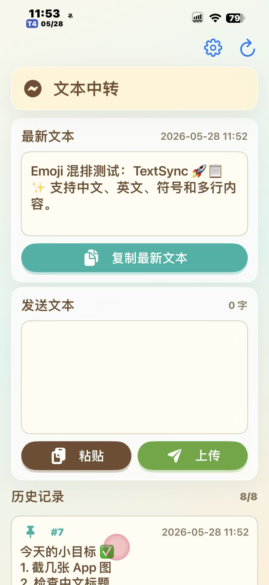
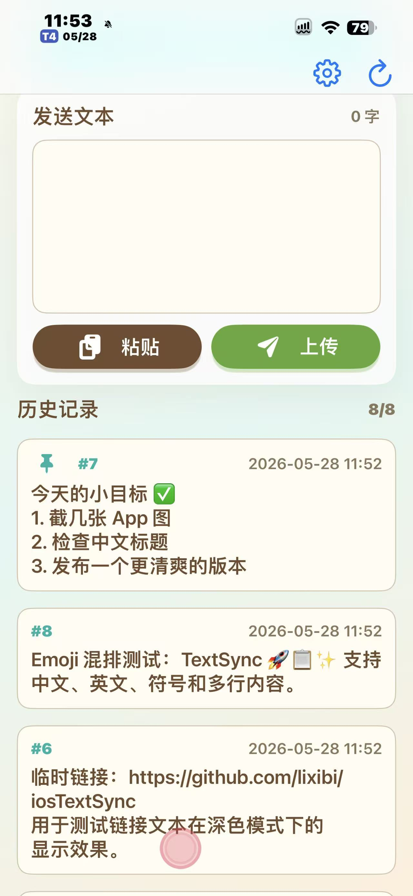

# TextSync iOS

TextSync iOS is a native SwiftUI client for syncing text through a lightweight relay server. It targets iOS 16, stores the server address locally on device, and can work with any reachable TextSync server.

<p>
  
  
</p>

## 中文说明

TextSync 是一个轻量级“文本中转”工具：在服务器上运行一个很小的 Docker 服务，然后用 iOS 客户端发送、获取和管理文本。适合公网服务器中转，也可以在局域网或测试环境里使用 HTTP 地址。

## 项目亮点

- 原生 SwiftUI 客户端：面向 iOS 16 + 开发，界面流畅，系统集成自然，没有 WebView 套壳。
- 柔和治愈的视觉风格：借鉴动物之森式的温暖配色、圆润卡片和轻松氛围，让工具类 App 也有一点可爱和松弛感。
- 完全自部署：服务端可以跑在自己的 VPS、家用服务器、NAS 或内网机器上，数据流向清晰可控。
- 轻量级服务端：Go 编写的单体服务，Docker 一条命令即可启动，资源占用低，冷启动快。
- 速度快、路径短：接口只做文本中转，上传、拉取、复制都尽量保持直接和迅速。
- 支持公网中转：推荐搭配 HTTPS 反向代理，在多设备之间稳定同步临时文本、链接、备忘和代码片段。
- 本地增强体验：历史记录本地缓存，支持置顶、本地隐藏、分页展示，不需要每次都完整依赖远程拉取。
- 快捷指令友好：提供上传剪贴板、获取远程文本等 Shortcuts 调用方式，适合做成一键复制/粘贴工作流。
- 开源可改造：iOS 客户端、服务端、Docker 构建和 GitHub Actions 都放在同一个仓库里，方便按自己的使用习惯继续改。

常用入口：

- iOS 安装包：查看 [最新 IPA Release](https://github.com/lixibi/iosTextSync/releases/tag/latest-ipa)
- Docker 镜像：`docker pull ghcr.io/lixibi/textsync-server:latest`
- 服务端说明：查看 [server/README.md](server/README.md)
- 自动构建：查看 [GitHub Actions](https://github.com/lixibi/iosTextSync/actions)

快速部署服务端：

```bash
docker pull ghcr.io/lixibi/textsync-server:latest
docker volume create textsync-data
docker run -d \
  --name textsync-server \
  --restart unless-stopped \
  -p 17006:8080 \
  -v textsync-data:/data \
  -e KEYSERVER_DATA_FILE=/data/keys.json \
  ghcr.io/lixibi/textsync-server:latest
```

部署完成后，在 iOS App 的设置里填写你的服务器地址即可。推荐使用 HTTPS 公网域名；测试时也允许使用 `http://IP:17006`。

## Features

- Native SwiftUI app for iOS 16 +
- Warm card-based interface inspired by cozy life-sim UI patterns
- Self-hosted lightweight relay server
- Fast text upload, fetch, copy, and paste workflows
- Recent history with local paging and caching
- Local pinning and hiding without mutating remote data
- Editable server address with HTTP and HTTPS support
- Shortcuts actions for clipboard upload and remote text fetch

## Server API

The bundled server source lives in `server/`. It is designed to run behind a public HTTPS reverse proxy for simple cross-device text relay.

- `GET /api/list` returns all entries as JSON
- `GET /api/get` returns the latest text
- `POST /api/post` uploads the request body as a new text entry

## Docker Server

GitHub Actions publishes the server image to GHCR:

```bash
docker pull ghcr.io/lixibi/textsync-server:latest
docker volume create textsync-data
docker run -d \
  --name textsync-server \
  --restart unless-stopped \
  -p 17006:8080 \
  -v textsync-data:/data \
  -e KEYSERVER_DATA_FILE=/data/keys.json \
  ghcr.io/lixibi/textsync-server:latest
```

Then point the iOS app at your public HTTPS domain or at `http://IP:17006` for local testing.

## GitHub Actions

Push this repository to GitHub, then run the workflow from the Actions tab. It builds an unsigned iOS IPA artifact and publishes the Docker server image.

## 致谢

- UI 设计参考了 [guokaigdg/animal-island-ui](https://github.com/guokaigdg/animal-island-ui) 的温暖、轻量和卡片式表达。
- iOS 客户端基于 SwiftUI、App Intents 和 Apple 平台能力开发。
- 服务端使用 Go 构建，并通过 Docker、GHCR 和 GitHub Actions 完成镜像发布与自动构建。
- 感谢所有相关开源项目和社区文档提供的基础能力与灵感。

## License

MIT License. See [LICENSE](LICENSE) for details.
